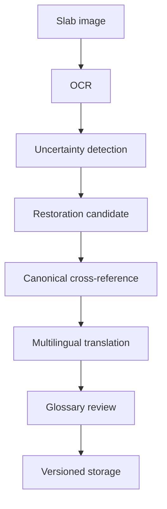

# KIDAT — Kuthodaw AI Heritage Engine

KIDAT is a prototype AI-assisted cultural heritage pipeline for digitizing, restoring, cross-referencing, and translating the 729 marble inscription slabs of the Kuthodaw Pagoda in Myanmar.

> Current status: prototype / pilot scaffold. This repository is designed to validate the data model, MiMo API workflow, prompt templates, and batch-worker architecture before full-corpus processing.

## Why
The Kuthodaw inscriptions are historically important but technically difficult to process: visual stone inscriptions, degraded characters, Pali/Burmese textual context, and multilingual translation requirements. KIDAT explores a structured AI workflow for careful, auditable processing.

## MiMo model usage
- **MiMo-V2.5-Omni**: visual OCR and degraded inscription analysis.
- **MiMo-V2.5-Pro**: reconstruction reasoning, canonical cross-reference, and translation.
- **MiMo-V2.5-Flash**: metadata extraction, batch classification, and low-cost validation.

## Pipeline




## Quick start

```bash
composer install
cp .env.example .env
php bin/kidat demo
php bin/kidat estimate
```

The default mode is mock mode, so the demo pipeline can run without API credentials. Real MiMo API mode can be enabled later through `.env`.

## Repository contents
- `docs/application_english.md` — application text for Xiaomi MiMo Orbit.
- `docs/token_justification.md` — rationale for large token allocation.
- `docs/architecture.md` — technical architecture.
- `prompts/` — prompt templates.
- `sql/schema.sql` — initial MySQL schema.
- `src/` — implementation scaffold, to be added.

## Design principles
- Preserve raw OCR, restored text, translations, confidence, and review notes separately.
- Do not silently hallucinate missing text.
- Every reconstruction should include confidence and evidence.
- Keep the pilot small, then scale with workers.
