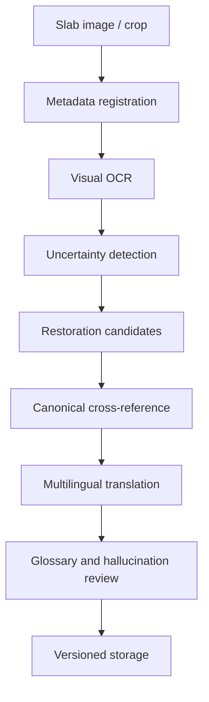

# KIDAT — Kuthodaw AI Heritage Engine

KIDAT is a prototype AI-assisted cultural heritage pipeline for digitizing, restoring, cross-referencing, and translating the 729 marble inscription slabs of the Kuthodaw Pagoda in Myanmar.

> **Status:** pilot scaffold. This repository currently validates the data model, MiMo-oriented workflow, prompt templates, token accounting, and worker architecture before real full-corpus processing.

## Why this project exists

The Kuthodaw inscriptions are a historically significant Buddhist textual corpus, but they are difficult to process with a conventional OCR workflow. The source material is visual, historical, multilingual, and may contain degraded or uncertain characters.

KIDAT explores a careful AI workflow that keeps every intermediate step auditable: raw OCR, uncertain spans, restoration candidates, translations, confidence scores, references, and review notes are stored separately.

## MiMo model strategy

The project is designed around Xiaomi MiMo's multimodal and reasoning capabilities:

- **MiMo-V2.5-Omni** — visual OCR, inscription layout analysis, and degraded-character inspection.
- **MiMo-V2.5-Pro** — restoration reasoning, canonical cross-reference, terminology consistency, and multilingual translation.
- **MiMo-V2.5-Flash** — lower-cost metadata extraction, segmentation, classification, and batch quality checks.

The goal is not to produce a single polished answer. The goal is to produce structured, reviewable evidence at each stage.

## Pipeline



## Quick start

```bash
composer install
cp .env.example .env
php bin/kidat demo
php bin/kidat estimate
```

The default mode is mock mode, so the demo pipeline can run without API credentials:

```env
KIDAT_MIMO_MOCK=true
```

Real MiMo API mode can be enabled later through `.env` after credentials and endpoint details are available.


## Data source strategy

KIDAT references an external public Kuthodaw image viewer repository as a candidate image source:

- Upstream: <https://github.com/kit119/KIT-729>
- Manifest: `data/upstream_kit729_manifest.jsonl`
- Inventory: 734 `.webp` image files, about 804 MB upstream

The full image corpus is not copied into this repository because the upstream repository does not declare a clear redistribution license. KIDAT stores source metadata and URLs only; real processing should use approved local copies or licensed source access.

## Repository contents

- `docs/application_english.md` — application draft for Xiaomi MiMo Orbit.
- `docs/token_justification.md` — token-demand rationale and scaling plan.
- `docs/architecture.md` — technical architecture and data policy.
- `docs/development.md` — local development notes.
- `prompts/` — prompt templates for OCR, restoration, translation, and review.
- `sql/schema.sql` — initial MySQL schema for versioned records.
- `src/` — PHP scaffold: MiMo client, pipeline, domain model, and token estimator.
- `fixtures/` — synthetic demo fixture for validating the pipeline shape.
- `data/` — upstream image-source manifest and licensing notes.
- `scripts/inspect_manifest.php` — quick manifest inventory check.

## Design principles

- Preserve raw OCR, restored text, translations, confidence, and review notes separately.
- Mark uncertainty explicitly; do not silently fill missing text.
- Require evidence and confidence for every restoration candidate.
- Use cheaper models for routine batch work and stronger models for difficult reasoning.
- Start with a small pilot, then scale through worker queues.

## Important note

This repository is a prototype scaffold. Demo outputs are placeholders for pipeline validation and are not verified scholarly transcriptions or translations.
