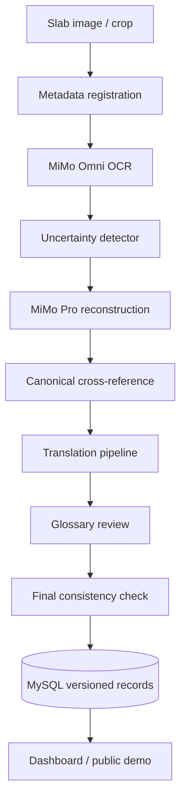

# Technical Architecture

## Overview
KIDAT uses a worker-centric architecture. Each slab is processed as a versioned job with clear intermediate artifacts.

## Components

### MiMoApiClient
Responsible for API calls, retries, rate limits, JSON validation, and token tracking.

### SlabRepository
Stores slab metadata, image paths, processing state, and version references.

### OcrWorker
Calls MiMo-V2.5-Omni to extract inscription text and uncertainty metadata.

### ReconstructionWorker
Calls MiMo-V2.5-Pro to suggest restorations for degraded characters with confidence scores.

### TranslationWorker
Generates multilingual translations while enforcing glossary consistency.

### ReviewWorker
Runs final consistency and hallucination checks.

## Data policy
Raw OCR, restored text, translation, confidence, and notes are stored separately. No destructive overwrite of prior versions.
