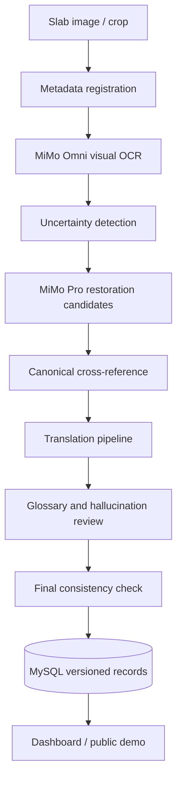

# Technical Architecture

## Overview

KIDAT uses a worker-centric architecture. Each slab is processed as a versioned job with clear intermediate artifacts. The system is designed to be auditable first and scalable second: every stage keeps its own output, confidence, evidence, and processing metadata.

## Components

### MiMoClient

Handles MiMo-compatible API calls, mock mode, structured JSON responses, and future retry/rate-limit logic.

### TokenEstimator

Provides planning estimates for model calls and token usage across pilot and full-corpus processing.

### HeritagePipeline

Coordinates OCR, reconstruction, translation, and review stages for a slab job. The current implementation runs in mock mode by default so the pipeline shape can be validated before real credentials are available.

### SlabRepository / future

Stores slab metadata, image paths, processing state, and version references. The initial MySQL schema is available in `sql/schema.sql`.

### Worker processes / future

Supervisor-managed PHP workers will consume queued slab jobs, call MiMo models, persist versioned records, and mark low-confidence regions for review or reprocessing.

### Data source manifest

`data/upstream_kit729_manifest.jsonl` lists candidate upstream image files from `kit119/KIT-729` without redistributing them. Workers can use the manifest to create ingestion jobs after licensing/permission checks.

## Data policy

Raw OCR, restored text, translations, confidence, evidence, and notes are stored separately. Prior versions are not destructively overwritten. This allows later comparison when prompts, glossary rules, or reference sources improve.

## Failure handling

Planned failure handling includes:

- retry with backoff for API/network failures
- rate-limit aware scheduling
- JSON schema validation for model outputs
- explicit `needs_human_review` flags for low-confidence regions
- token accounting per model call and per slab

## Deployment target

- PHP 8.2+
- Ubuntu server
- MySQL 8
- Supervisor-compatible background workers
- Optional future vector/graph layer for semantic search and knowledge exploration
