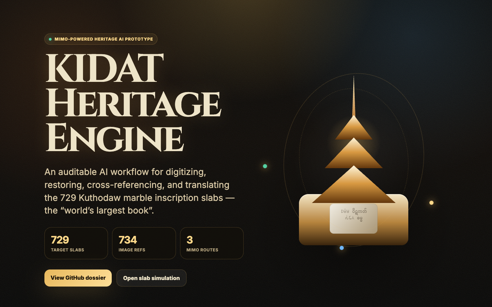
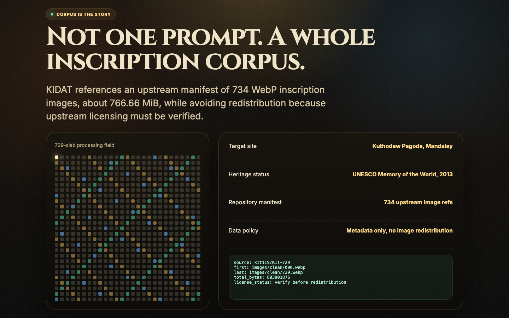
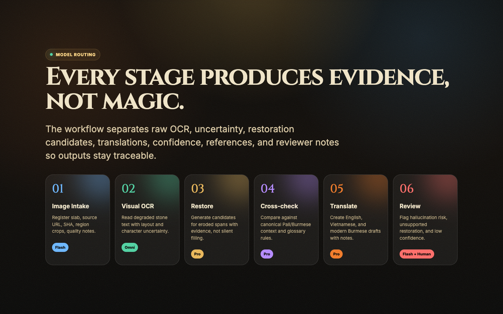
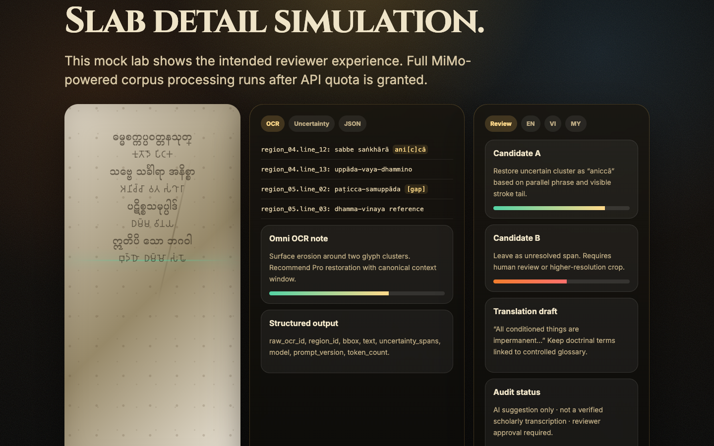
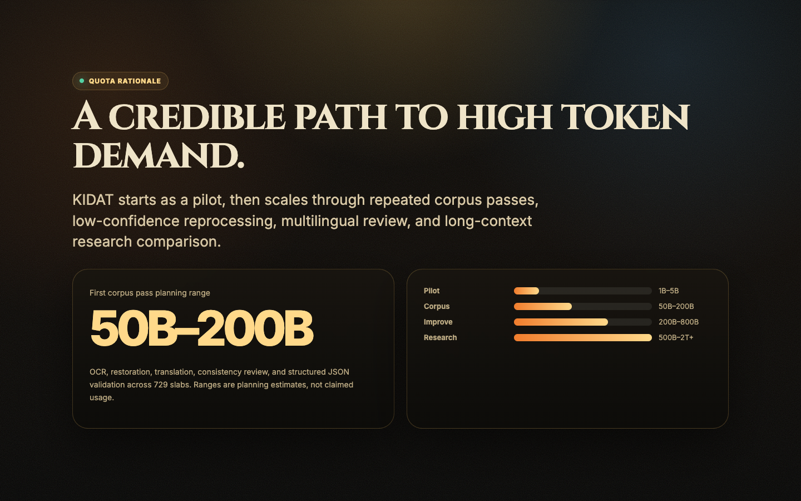

# KIDAT Interactive Prototype

Public demo: <https://demo.tutu.mobi/kidat/>

This prototype is a visual proof-of-work for the MiMo application. It demonstrates the intended corpus scale, model-routing workflow, slab-level OCR/restoration/review interface, and token-demand rationale.

> Prototype note: full MiMo-powered corpus processing will run after API quota is granted. Demo inscription text and slab visualization are illustrative placeholders, not verified Kuthodaw transcriptions.

## Screenshots

### Hero

### Corpus manifest

### MiMo pipeline

### Slab OCR / restoration / review simulation

### Token scale rationale

